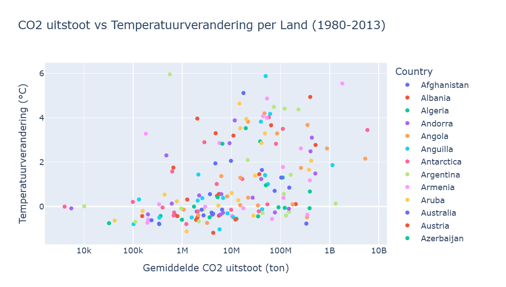

# Bonus Rapportage

## Inleiding
In deze bonusanalyse vergelijken we de temperatuurverandering per land (1980-2013) 
met externe factoren zoals CO2 uitstoot, ontbossing, bevolkingsgroei en economische groei.

### CO2 vs. Temperatuur conclusies

1. Landen met lage CO2 uitstoot (links, <100k ton) warmen nauwelijks op, kleine eilanden en tropische landen
2. Landen met middelhoge CO2 uitstoot (1M-100M ton) tonen de grootste spreiding, sommige warmen sterk op tot +6°C
3. Grote uitstoters (rechts, >1B ton) zoals China en VS warmen gemiddeld +2-3°C op

### Ontbossing vs. Temperatuur conclusies 

1. De meeste landen zitten rond 0, weinig verandering in bosoppervlak
2. Links (negatief, ontbossing) → één land verliest veel bos (~-4M km²) maar warmt nauwelijks op, dit is waarschijnlijk Brazilië
3. Rechts (positief, herbebossing) → Argentinië (+2M km²) warmt +3.5°C op, dit lijkt tegenstrijdig maar komt door geografische ligging
4. Er is geen duidelijk verband tussen ontbossing en temperatuurverandering per land. 

### Bevolkingsgroei vs. temperatuur conclusies
1. Landen met negatieve bevolkingsgroei (links) warmen sterk op tot +6°C, dit zijn voornamelijk Oost-Europese landen zoals Rusland en Oekraïne die krimpen in bevolking maar sterk opwarmen
2. Landen met weinig groei (0-50%) tonen de grootste spreiding in temperatuurverandering
3. Landen met sterke bevolkingsgroei (>200%) warmen nauwelijks op, dit zijn voornamelijk warme Afrikaanse landen die al warm zijn
4. Er is een negatief verband, hoe meer bevolkingsgroei, hoe minder opwarming. Net zoals bij armoede komt dit door geografische ligging, warme landen groeien sneller in bevolking maar warmen minder op

Conclusie voor je rapportage:
Bevolkingsgroei en temperatuurverandering hebben geen direct verband. 

### Industriële productie per land
1. China (lichtblauw, ~38%) warmt +3.5°C op, hoog industrieel aandeel en sterke opwarming
2. Denemarken (roze, ~30%) warmt +5.9°C op, sterk opwarmend ondanks gemiddeld industrieel aandeel, komt door Arctic Amplification
3. Landen met hoog industrieel aandeel (>40%) warmen nauwelijks op, dit zijn warme landen zoals Botswana en Ghana
4. Er is geen duidelijk verband, geografische ligging speelt weer een grotere rol dan industrieel aandeel

Conclusie:
Het industriële aandeel van de economie heeft geen direct verband met temperatuurverandering per land. 

### Energieverbruik vs temperatuur per land
1. Landen met hoog energieverbruik (rechts, >1000 TWh) hebben temperaturen tussen -5°C en 25°C — dit zijn grote industriële landen zoals China, VS en Rusland
2. Warme landen (boven, 25-30°C) hebben relatief laag energieverbruik — kleine tropische landen
3. Mongolia (paars) valt op — koud maar relatief hoog energieverbruik door verwarming
Er is geen duidelijk rechtstreeks verband — grote landen verbruiken meer energie maar zijn niet per se warmer

### Energiebronnen per land (fossiel, hernieuwbaar, etc) vs. temperatuur per land
1. Links (0-10% hernieuwbaar) → de meeste landen zitten hier en hebben een grote spreiding in temperatuurverandering van -1°C tot +6°C. Rusland valt op met +5.5°C opwarming maar slechts 5.6% hernieuwbaar.
2. Rechts (>40% hernieuwbaar) → landen met veel hernieuwbare energie hebben een lagere temperatuurverandering rond 0-4°C
3. Er is een licht negatief verband → landen met meer hernieuwbare energie warmen minder snel op, maar het verband is niet heel sterk
4. Landen met 0% hernieuwbaar → sommige warmen sterk op, andere helemaal niet, dit bevestigt dat geografische ligging ook een grote rol speelt

Conclusie: 
Meer hernieuwbare energie lijkt samen te gaan met minder opwarming, maar het is geen directe oorzaak-gevolg relatie.

### Armoede index per land vs. temperatuurstijging per land

1. Landen met weinig armoede (links, 0-10%) hebben de grootste temperatuurverandering, dit zijn rijke noordelijke landen zoals Rusland, Belarus en Armenië die sterk opwarmen door Arctic Amplification
2. Landen met veel armoede (rechts, >40%) warmen juist minder op, dit zijn voornamelijk warme Afrikaanse landen die al warm zijn en minder opwarmen
3. Er is een negatief verband, hoe meer armoede, hoe minder temperatuurstijging. Dit klinkt tegenstrijdig maar heeft een verklaring:

    - Arme landen liggen voornamelijk in de tropen waar al weinig opwarming plaatsvindt
    - Rijke noordelijke landen warmen het snelst op

### Armoede index vs. absolute temperatuur per land
1. Rijke landen (links, 0-5% armoede) hebben een grote spreiding in temperatuur van -20°C tot 30°C, rijke landen komen in alle klimaten voor
2. Arme landen (rechts, >40% armoede) liggen bijna allemaal tussen 20-30°C, armoede is geconcentreerd in warme tropische landen
3. Er is een duidelijk positief verband, hoe warmer een land, hoe meer armoede. Redenen hiervoor kunnen zijn: 

    - Warme landen vaker te maken hebben met droogte en misoogsten
    - Extreme hitte vermindert arbeidsproductiviteit
    - Tropische landen hebben historisch minder economische ontwikkeling gehad

### Economische groei per land (BBP) vs. temperatuursstijging
1. Arme landen (links, <$2000 GDP) warmen nauwelijks op — dit zijn voornamelijk warme Afrikaanse landen die al warm zijn
2. Middeninkomen landen ($5000-$20000) tonen de grootste spreiding — sommige warmen sterk op, andere niet
3. Rijke landen (rechts, >$50000) hebben een gemiddelde opwarming van 1-4°C — dit zijn noordelijke landen die sterk opwarmen door Arctic Amplification
4. Er is een licht positief verband — rijkere landen warmen meer op, maar dit komt vooral door geografische ligging — rijke landen liggen vaker in het noorden

    - Rijke landen warmen sneller op maar hebben meer middelen om zich aan te passen. Arme landen warmen minder snel op maar zijn kwetsbaarder omdat ze minder middelen hebben om zich aan te passen aan klimaatverandering.

## Algemene conclusie
De geografische ligging is de grootste bepalende factor voor zowel absolute temperatuur 
als temperatuurverandering. Noordelijke landen warmen het snelst op door Arctic Amplification. 
CO2 uitstoot en energieverbruik hebben een indirect maar meetbaar verband met opwarming. (bron: claude)
